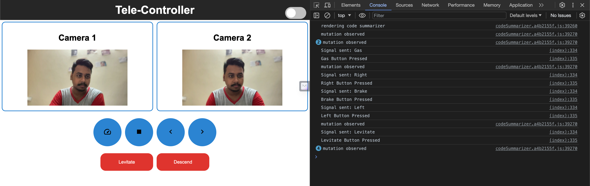
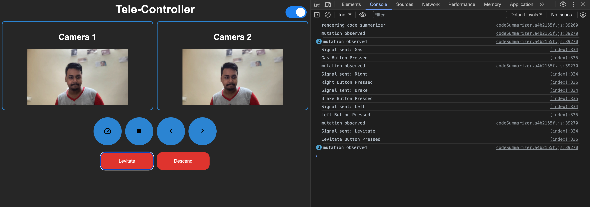
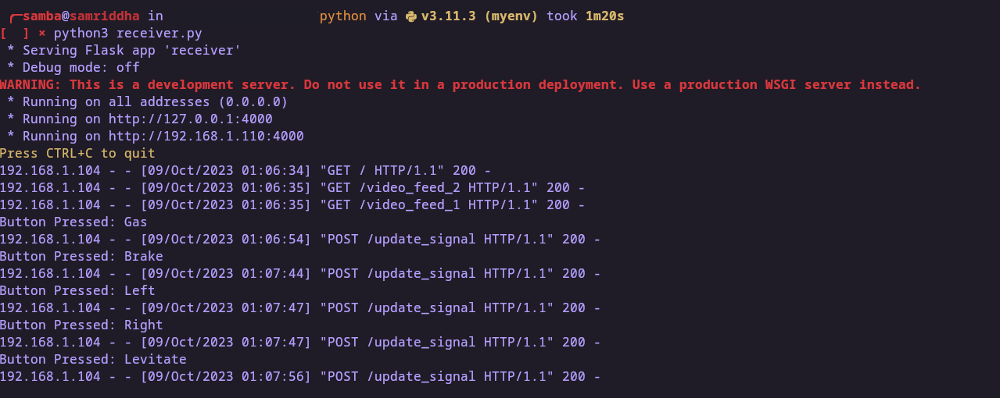
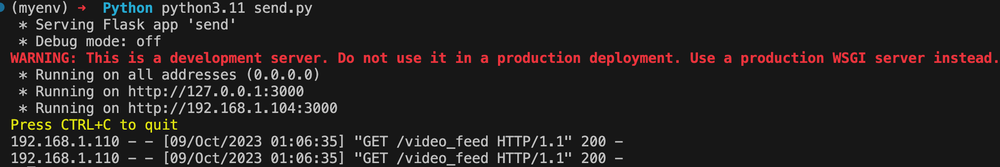

<!-- Title -->
<h1 align="center">Tele-Controller</h1>

<!-- Project Description -->
<p align="center">
  Low-latency video streaming and remote control system with live feedback, The Elder Wand for most of the IoT devices.
</p>

<!-- Project Icons -->
<p align="center">
  
  
  
  
</p>

<!-- Introduction -->
## Introduction

Tele-Controller is a versatile system that provides low-latency video streaming and remote control capabilities. It uses Python, Flask, and OpenCV to deliver live video feedback while enabling remote control through a user-friendly interface.

<!-- Screenshots -->
## Screenshots

 
 
 
  

<!-- How to Use -->
## How to Use

Follow these steps to set up and run Tele-Controller:

1. Clone the repository to your local machine:
   ```bash
   https://github.com/samriddha-basu-cloud/Tele-Controller.git
   ```

2. Navigate to the project directory:
   ```bash
   cd Tele-Controller
   ```

3. Install the required dependencies:
   ```bash
   pip install opencv-python flask requests
   ```

4. Run the receiver application:
   ```bash
   python receiver.py
   ```

5. Access the web interface at `http://localhost:4000` to view the video feeds and control the system.

<!-- Use Cases -->
## Use Cases

Tele-Controller can be used in various scenarios:

- **Remote Surveillance:** Monitor a location remotely by streaming live video feeds.
- **IoT Automation:** Control IoT devices and receive real-time feedback.
- **Security Systems:** Enhance security systems with live video streaming and remote control.
- **Robotics:** Implement remote control for robots and drones.
- **Education:** Use it for remote learning and interactive demonstrations.

<!-- Contribution -->
## Contribution

Contributions to this project are welcome! If you have ideas for improvements or new features, feel free to submit issues or pull requests.

<!-- License -->
## License

This project is open-source and does not have a specific license. Feel free to use it for personal or commercial purposes.

---
